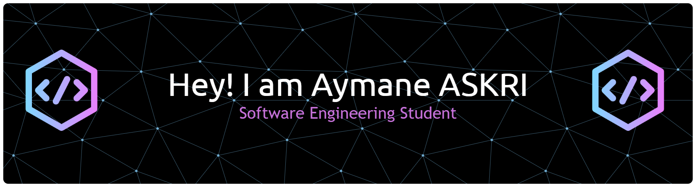

<!-- Header -->

  

<h1 align="center">Hi 👋, I'm Aymane ASKRI</h1>
<h3 align="center">Software Engineering Student at INPT | Full-Stack Developer | AI & Automation Enthusiast</h3>

---

<h3 align="left">👨🏻‍💻 About Me</h3>

- 🎓 Engineering degree in **Software Engineering** at **INPT, Rabat** (2022-2026).  
- 💡 Founder & CEO of **MediTrack**, a SaaS platform for clinic management (Web & Desktop).  
- 🔬 Internship at **Estaty (UAE)** → built *EstAIty*, an AI-powered data automation platform.  
- 🌱 Passionate about **Full-Stack Development, AI/LLMs, and Automation**.  
- 🏀 Interests: Basketball, Gaming.  

---

<h3 align="left">🛠 Languages and Tools</h3>

**Languages**  

  
  
  
  
  

**Frameworks & Development**  

  
  
  
  
  
  
  

**Databases & Cloud**  

  
  
  
  

**AI & Tools**  

  
  
   <!-- keras -->
  
  

---

<h3 align="left">🚀 Featured Projects</h3>

- **[MediTrack](https://www.meditrack.site)** → SaaS clinic management (Web & Desktop).  
- **[EstAIty](https://www.youtube.com/watch?v=ewN-awv15uw)** → AI-powered automation for real estate data.  
- **1337 School Canteen App** → Reduced waste & optimized meal management.  
- **Predictive Drawing** → AI Canvas app predicting hand-drawn shapes.  
- **Green Robot** → Plant disease detection with Deep Learning.  

---

<h3 align="left">⚙️ GitHub Analytics</h3>

